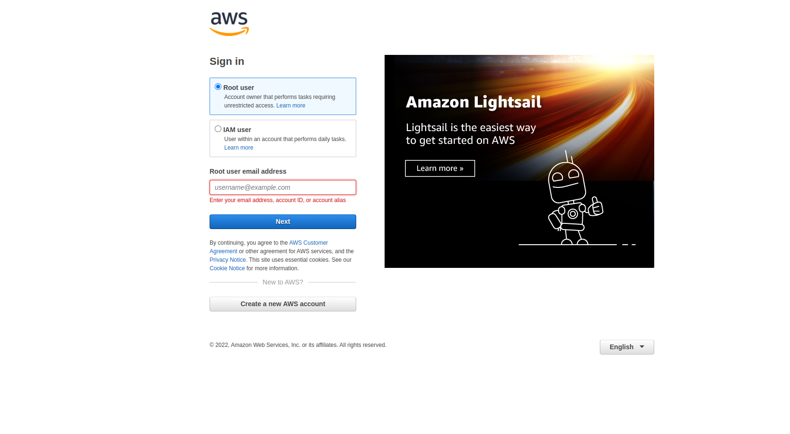
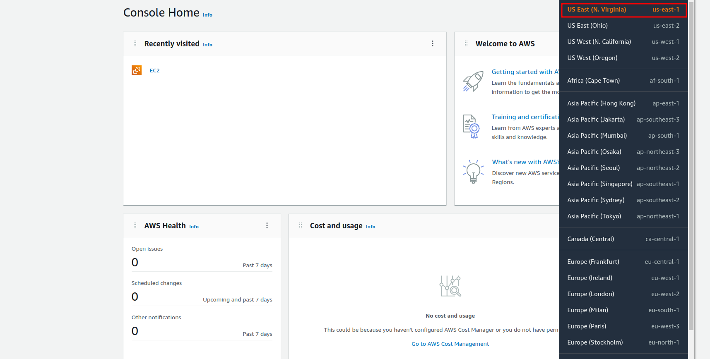
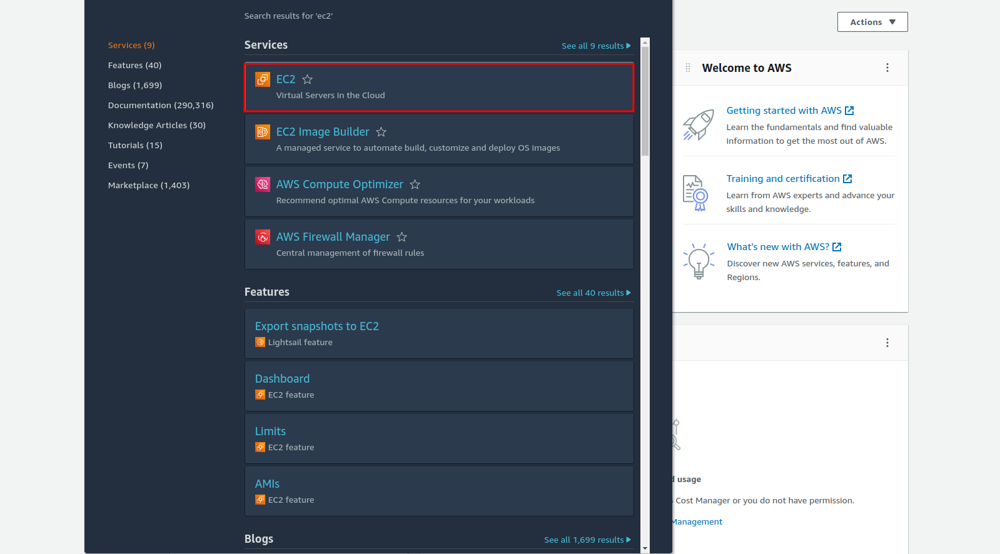
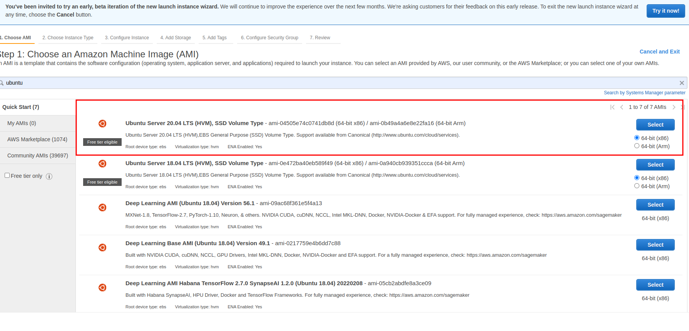

# web-stack-implementation

Hello and welcome to the Web Stack Implementation project!

What is a Web Stack? It is is a group of software components, used to implement or set up various applications (for example, a website). The "stack" refers to the specific layered components (e.g. OS system, webserver, script interpreter, and database) which are built on top of each other. One of the most popular web stacks include LAMP, which stands for Linux, Apache, MySQL, and PHP. The LAMP stack will be used for this project!

LINUX
Setting up your virtual environment
Linux is an operating system that manages the underlying hardware on your PC. It is an open-source software that is used worldwide. It is flexible and easy to configure.

In order to complete this project, it is necessary to set up a virtual environment. In order to achieve this, first, create a free AWS account and then create a virtual server using the Ubuntu Server OS. More details to come shortly!

You may be wondering, 'what is AWS'? Amazon Web Services (AWS) is the leading Cloud Service Provider in the world. AWS offers a wide variety of databases and services for different types of applications. This allows users to choose the right tool for the job while receiving the best cost and performance.

AWS offers a Free Tier for newly registered account users. This enables users to try out some AWS services free of charge within certain usage limits. For this project, we will utilize the EC2 (Elastic Compute Cloud) service, which is covered by the Free Tier!

Let's get started!

Begin by registering and setting up an AWS account and following the directions on the screen. Once you have created your AWS account, navigate to the login page and type in your credentials.

Once you have signed-in to your AWS account, navigate to the top-right of the screen and select your preferred region (this should be the closest region to your physical location).

After you have selected your region, navigate to the search bar and type in EC2. Select the EC2 service that appears.

Next, click on "Launch Instances".

Now we are going to configure our EC2 instance! Select the Ubuntu Server 20.04 LTS (HVM) as the Amazon Machine Image (AMI).

